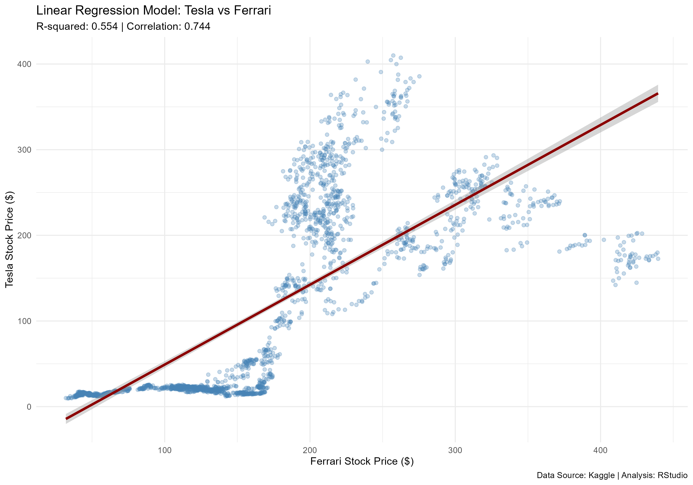

# Automotive Giants Stock Correlation Analysis 🏎️⚡

## Project Overview
This project performs a comparative analysis and **Linear Regression** between the stock prices of **Tesla (TSLA)** and **Ferrari (RACE)**. The goal is to investigate how much of Tesla's price movement can be explained by Ferrari's market performance using data from 2015 to 2024.

## Tech Stack
* **Language:** R
* **Libraries:** `tidyverse`, `ggplot2`
* **Model:** Simple Linear Regression (OLS)

## Key Findings
* **Correlation:** ~0.74 (Strong positive relationship)
* **R-squared:** 0.554 (The model explains 55.4% of the variance)
* **P-value:** < 2.2e-16 (Statistically highly significant)

## Visualizations

## How to Run
1. Clone this repository.
2. Open the `Analysis_Script.R` in RStudio.
3. Set your working directory and run the script to reproduce the results.
